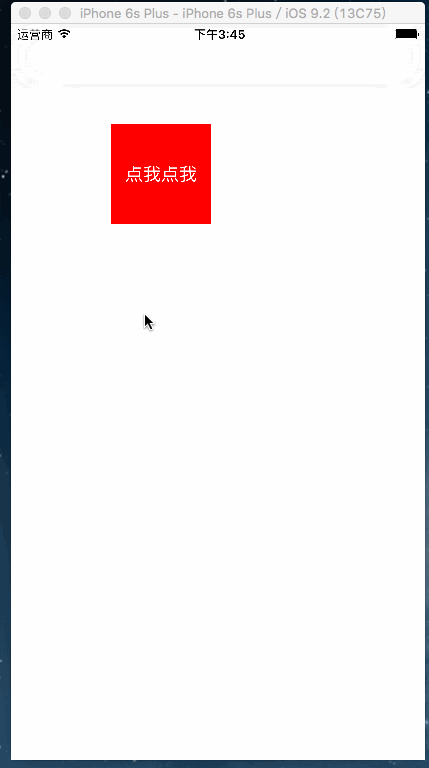

# SegmentPageController
一句话实现分段控制器的切换,有木有感觉到最强封装...
下载了不给STAR以后不分享了.




### 废话不多说直接上代码...

```
LZPageViewController *pageVc = [[LZPageViewController alloc] initWithTitles:@[@"交易成功",@"待发货",@"配送中",@"待结算",] controllersClass:@[[PageCell1Controller class],[PageCell1Controller class],[PageCell2Controller class],[PageCell2Controller class]]];
```

##期待
* 我是雷布斯.
* 如果在使用过程中遇到BUG，希望你能Issues我，谢谢!
* 如果在使用过程中发现功能不够用，希望你能Issues我.
